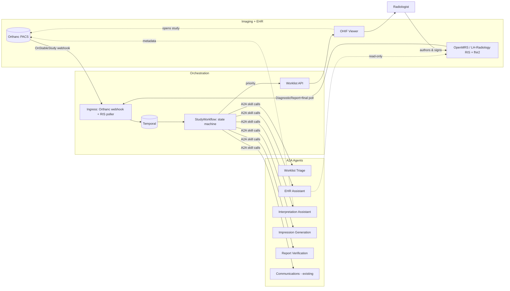
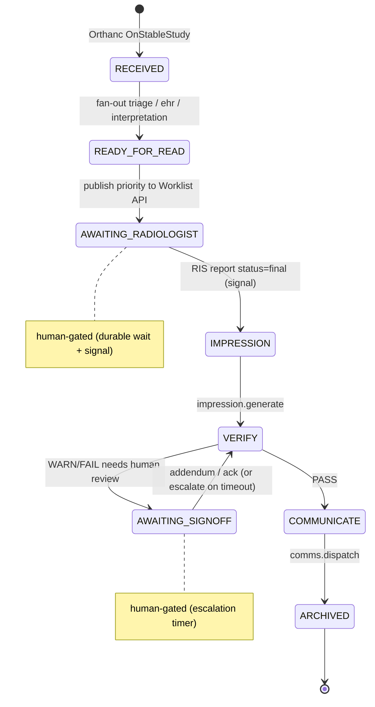
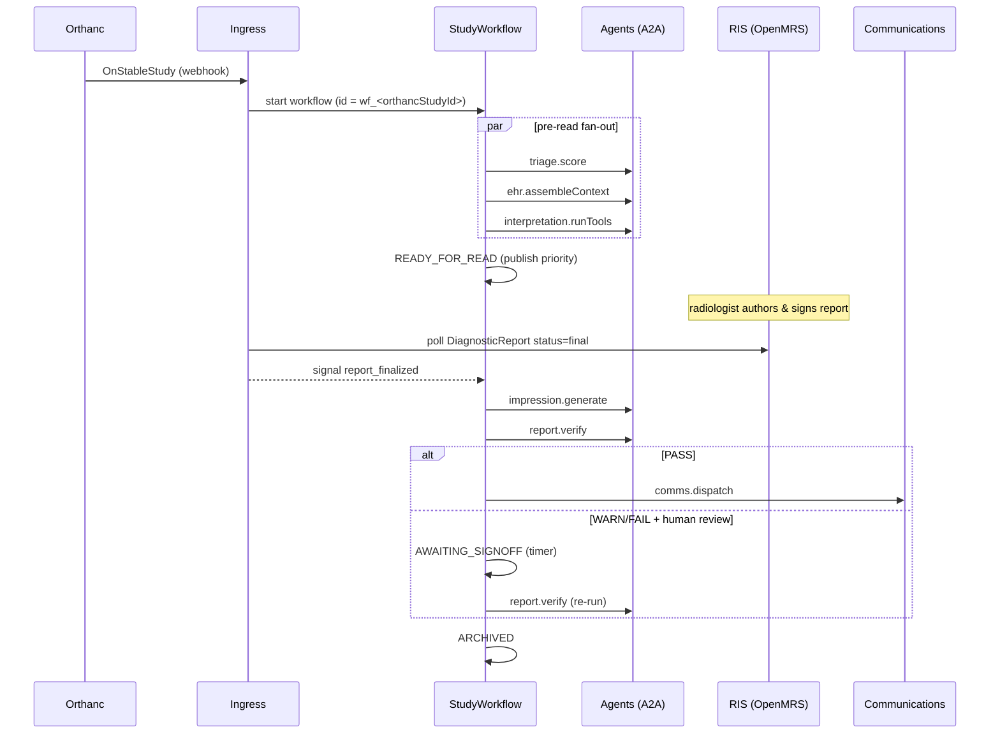

# ARCHITECTURE

Diagrams for the LH-Radiology multi-agent system. Contracts: `/contracts`. Decisions + glossary: `CLAUDE.md`. Backlog: GitLab issues.

## Components

## State machine (one workflow instance per study)

## Sequence — happy path

## Trigger map
Summary: **Orthanc** Python plugin → ingress webhook starts the workflow;
the **RIS poller** (`fhir2 DiagnosticReport?status=final&_lastUpdated=gt{cursor}`) signals the
waiting workflow; **OHIF** reads the **Worklist API** for the priority-ordered reading list
(M2: emits `StudyOpenedEvent` for pre-sign assist).

## Deployment (dev)
`docker-compose.yml` brings up Orthanc, OHIF, OpenMRS + MariaDB, and the Temporal stack
(server + Postgres + UI). Orchestrator (ingress + worker) and the six agents run as services
in M1 (Dockerfiles added then). Temporal hosting is self-hosted for dev; Temporal Cloud is a
prod option. Image tags in compose are starting points — pin them per environment.
